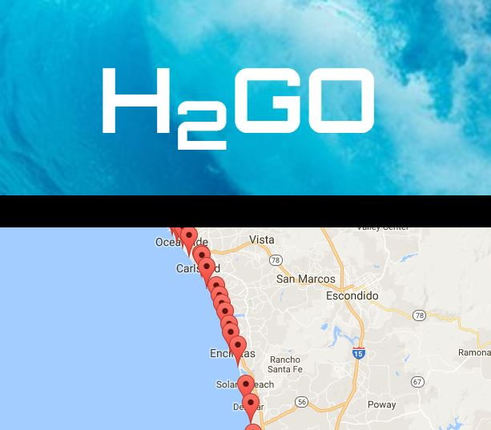

# H2GO

Surf Spot Locator Application

●	In a team of three people, we developed a single page surf spot application that is easy to use via a simple UI.

●	We developed this app using Javascript and JQuery

●	APIs: Google Maps v3, Firebase Realtime database, Firebase Authentication and Spitcast 

●	Styling and functionality: we used Bootstrap for styling and modals for user authentication and error catching

●	Tim Thompsen, Brian Hafner and Brian Patrick

